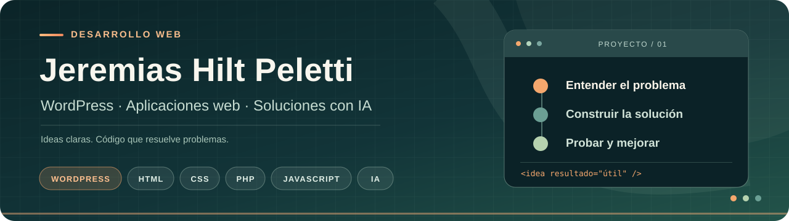

  

## Hola, soy Jeremias 👋

Desarrollo sitios y soluciones web con foco en **WordPress**. Me interesa entender cómo funciona por dentro para construir funcionalidades propias, además de crear interfaces claras y útiles para quienes las usan.

En este GitHub documento proyectos que resuelven problemas concretos y muestran lo que voy aprendiendo. También exploro aplicaciones web fuera de WordPress.

### Tecnologías con las que trabajo

<table>
  <tr>
    <td align="center" width="140"> <strong>WordPress</strong></td>
    <td align="center" width="140"> <strong>HTML</strong></td>
    <td align="center" width="140"> <strong>CSS</strong></td>
  </tr>
  <tr>
    <td align="center"> <strong>PHP</strong></td>
    <td align="center"> <strong>JavaScript</strong></td>
    <td align="center"> <strong>IA</strong></td>
  </tr>
</table>

También trabajo con Elementor / Theme Builder y WooCommerce. Aplico hooks, `WP_Query` y personalizaciones con PHP, y exploro la IA para crear soluciones web. Estoy profundizando en JavaScript y PHP para avanzar hacia el desarrollo de themes, plugins e integraciones.

### Proyecto destacado

**[Eudai Informes](https://github.com/JeremiasHiltPeletti/eudai-informes-web)** — aplicación web para redactar informes profesionales, previsualizarlos en A4 y descargarlos como PDF. Incluye validación, historial local y exportación de respaldos. [Ver la aplicación](https://eudai-informes.netlify.app/#/).

### Encontrame en

🌐 **[Mi portfolio](https://jeremiashiltpeletti.com/)** — trabajos, servicios y contacto.
